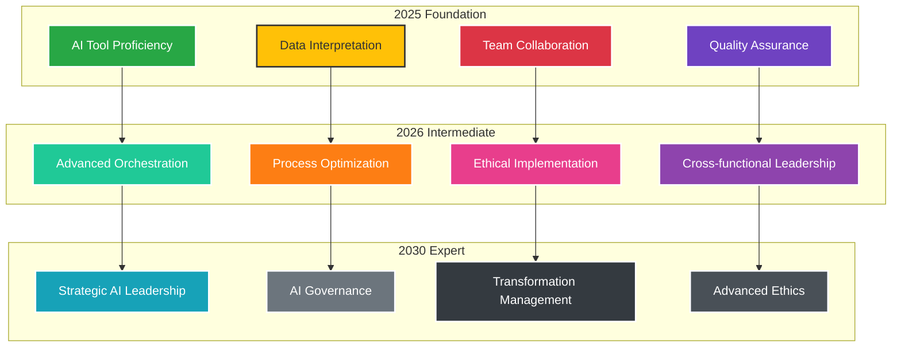

# Skill Matrix 2025 / 2026 / 2030
Future-ready PM competencies

## PM Skills Evolution 2025-2030

On-slide sources: LinkedIn Workplace Learning 2025; Coursera Global Skills 2025; McKinsey — Skills of the Future 2025.

[LinkedIn Learning 2025]: https://learning.linkedin.com/resources/workplace-learning-report
[Coursera 2025]: https://www.coursera.org/press
[McKinsey Skills 2025]: https://www.mckinsey.com/capabilities/people-and-organizational-performance/our-insights
