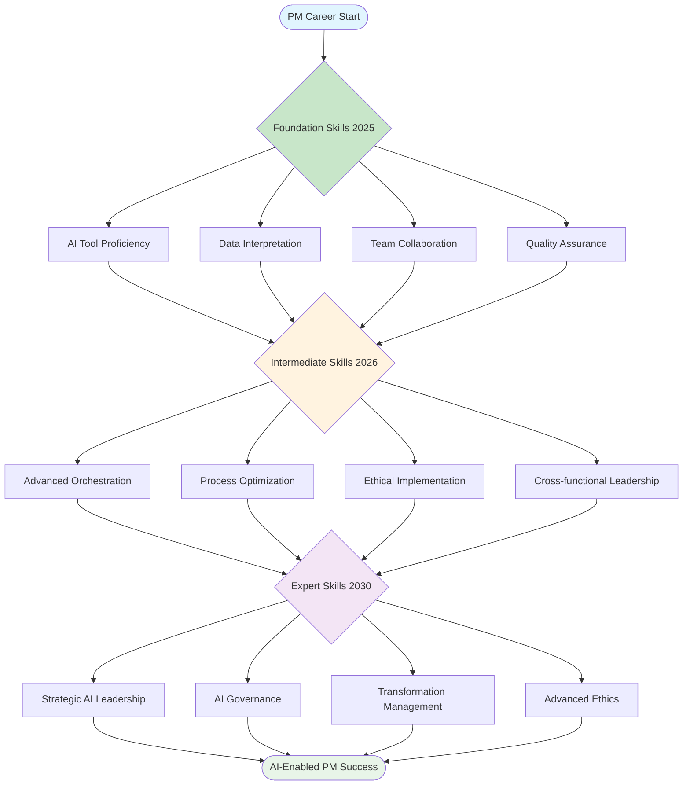

# Learning Path Visualization
PM AI Skills Development Roadmap

## Complete Learning Journey

## Key Learning Milestones

**2025 Foundation Phase**
- Master AI tool proficiency and basic prompting
- Develop data interpretation capabilities
- Build team collaboration skills with AI
- Establish quality assurance processes

**2026 Intermediate Phase**
- Advance orchestration and process optimization
- Implement ethical AI practices
- Lead cross-functional AI initiatives
- Develop strategic thinking with AI insights

**2030 Expert Phase**
- Lead strategic AI transformation
- Establish AI governance frameworks
- Manage organizational AI adoption
- Drive ethical AI implementation

On-slide sources: LinkedIn Workplace Learning 2025; Coursera Global Skills 2025; McKinsey — Skills of the Future 2025.

[LinkedIn Learning 2025]: https://learning.linkedin.com/resources/workplace-learning-report
[Coursera 2025]: https://www.coursera.org/press
[McKinsey Skills 2025]: https://www.mckinsey.com/capabilities/people-and-organizational-performance/our-insights
