# Skill Matrix Visualization 2025-2030

## Skill Matrix Diagram

```mermaid
graph TD
    A[PM Skills Evolution 2025-2030] --> B[Strategy & Vision]
    A --> C[Data & Analytics]
    A --> D[Orchestration & Leadership]
    A --> E[Evaluation & Ethics]
    
    B --> B1[2025: AI-assisted planning]
    B --> B2[2026: Cross-functional AI collaboration]
    B --> B3[2030: Strategic AI leadership]
    
    C --> C1[2025: AI tool proficiency]
    C --> C2[2026: Advanced data interpretation]
    C --> C3[2030: AI-driven insights mastery]
    
    D --> D1[2025: Basic AI team management]
    D --> D2[2026: Process optimization]
    D --> D3[2030: AI transformation leadership]
    
    E --> E1[2025: AI output validation]
    E --> E2[2026: Ethical AI implementation]
    E --> E3[2030: AI governance expertise]
    
    style A fill:#5A189A,stroke:#fff,stroke-width:2px,color:#fff
    style B fill:#28a745,stroke:#fff,stroke-width:2px,color:#fff
    style C fill:#ffc107,stroke:#333,stroke-width:2px,color:#333
    style D fill:#dc3545,stroke:#fff,stroke-width:2px,color:#fff
    style E fill:#6f42c1,stroke:#fff,stroke-width:2px,color:#fff
```

## Skill Progression Timeline

### 2025: Foundation Phase
- **AI Tool Proficiency**: Basic prompting and tool usage
- **Data Interpretation**: Understanding AI-generated insights
- **Team Collaboration**: Working with AI assistants
- **Quality Assurance**: Validating AI outputs

### 2026: Intermediate Phase
- **Advanced Orchestration**: Managing AI-human workflows
- **Process Optimization**: AI-driven efficiency improvements
- **Ethical Implementation**: Responsible AI deployment
- **Cross-functional Leadership**: AI-enabled team management

### 2030: Expert Phase
- **Strategic AI Leadership**: Vision-setting with AI insights
- **AI Governance**: Policy and framework development
- **Transformation Management**: Leading AI adoption
- **Ethical AI Expertise**: Advanced governance and compliance

## Competency Mapping

| Skill Area | 2025 | 2026 | 2030 |
|------------|------|------|------|
| **Strategy** | AI-assisted planning | Cross-functional AI collaboration | Strategic AI leadership |
| **Data** | Tool proficiency | Advanced interpretation | AI-driven insights mastery |
| **Orchestration** | Basic team management | Process optimization | AI transformation leadership |
| **Ethics** | Output validation | Ethical implementation | AI governance expertise |

## Learning Resources

### 2025 Foundation
- AI tool training programs
- Basic prompt engineering
- Data visualization courses
- Collaboration workshops

### 2026 Intermediate
- Advanced AI orchestration
- Process optimization training
- Ethics in AI courses
- Leadership development

### 2030 Expert
- Strategic AI leadership
- AI governance frameworks
- Transformation management
- Advanced ethics and compliance
