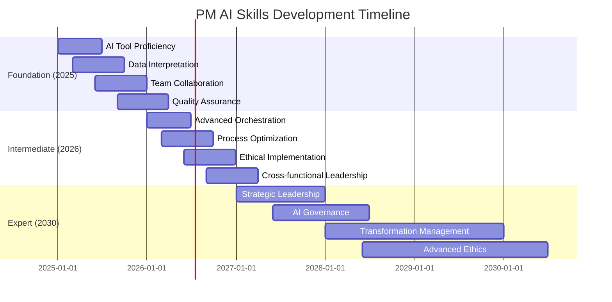

# Detailed Skill Matrix 2025-2030

## Skill Progression Matrix

| Capability Area | 2025 Foundation | 2026 Intermediate | 2030 Expert |
|----------------|-----------------|-------------------|-------------|
| **Strategy & Vision** | • AI-assisted scenario planning • Basic market analysis with AI • Data-driven decision making | • Cross-functional AI collaboration • Advanced scenario modeling • Strategic AI integration | • Strategic AI leadership • AI-driven vision setting • Transformation strategy |
| **Data & Analytics** | • AI tool proficiency • Basic prompt engineering • Data interpretation | • Advanced data visualization • AI model evaluation • Metrics optimization | • AI insights mastery • Predictive analytics leadership • Data strategy development |
| **Orchestration** | • Basic AI team management • Workflow optimization • AI tool integration | • Process automation • Advanced team coordination • AI workflow design | • AI transformation leadership • Organizational change • Strategic process redesign |
| **Evaluation & Ethics** | • AI output validation • Quality assurance • Basic risk assessment | • Ethical AI implementation • Compliance monitoring • Bias detection | • AI governance expertise • Policy development • Advanced ethics leadership |

## Learning Pathways by Year

### 2025: Foundation Building
**Focus**: Basic AI collaboration and tool proficiency

**Key Skills**:
- Prompt engineering fundamentals
- AI tool selection and usage
- Basic data interpretation
- Team collaboration with AI
- Quality assurance processes

**Learning Resources**:
- AI tool training programs
- Prompt engineering courses
- Data visualization basics
- Collaboration workshops
- Quality assurance training

### 2026: Intermediate Development
**Focus**: Advanced orchestration and ethical implementation

**Key Skills**:
- Advanced AI orchestration
- Process optimization
- Ethical AI deployment
- Cross-functional leadership
- Advanced analytics

**Learning Resources**:
- Advanced AI orchestration courses
- Process optimization training
- Ethics in AI programs
- Leadership development
- Advanced analytics courses

### 2030: Expert Mastery
**Focus**: Strategic leadership and AI governance

**Key Skills**:
- Strategic AI leadership
- AI governance frameworks
- Transformation management
- Advanced ethics and compliance
- Vision setting with AI

**Learning Resources**:
- Strategic AI leadership programs
- AI governance frameworks
- Transformation management courses
- Advanced ethics training
- Executive AI programs

## Competency Assessment Framework

### Foundation Level (2025)
- **Technical**: Can use AI tools effectively
- **Analytical**: Interprets AI-generated insights
- **Collaborative**: Works with AI assistants
- **Quality-focused**: Validates AI outputs

### Intermediate Level (2026)
- **Strategic**: Integrates AI into business processes
- **Leadership**: Manages AI-human teams
- **Ethical**: Implements responsible AI practices
- **Optimization**: Improves processes with AI

### Expert Level (2030)
- **Visionary**: Sets AI-driven strategic direction
- **Transformational**: Leads AI adoption
- **Governance**: Develops AI policies and frameworks
- **Ethical Leadership**: Ensures responsible AI implementation

## Skill Development Timeline

## Key Performance Indicators (KPIs)

### 2025 Foundation Metrics
- AI tool adoption rate
- Prompt engineering effectiveness
- Data interpretation accuracy
- Team collaboration efficiency
- Quality assurance success rate

### 2026 Intermediate Metrics
- Process optimization impact
- Ethical AI implementation compliance
- Cross-functional collaboration success
- Advanced analytics utilization
- Leadership effectiveness

### 2030 Expert Metrics
- Strategic AI initiative success
- AI governance framework adoption
- Transformation project outcomes
- Ethical compliance rates
- Vision execution effectiveness
