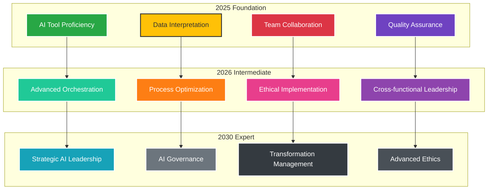
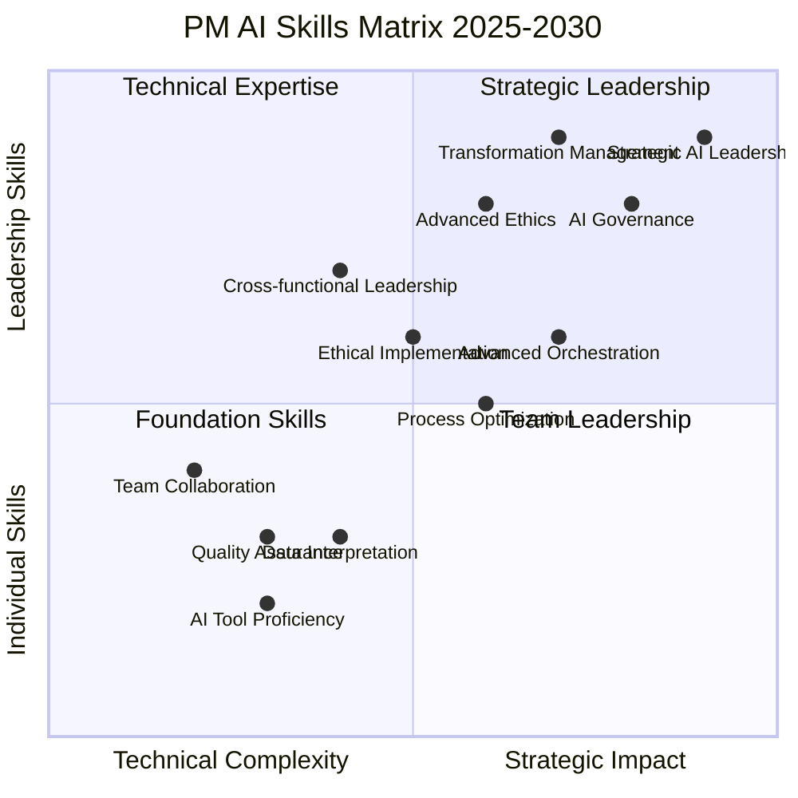
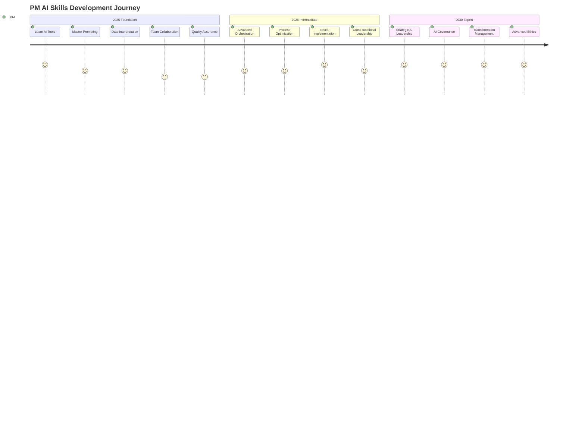
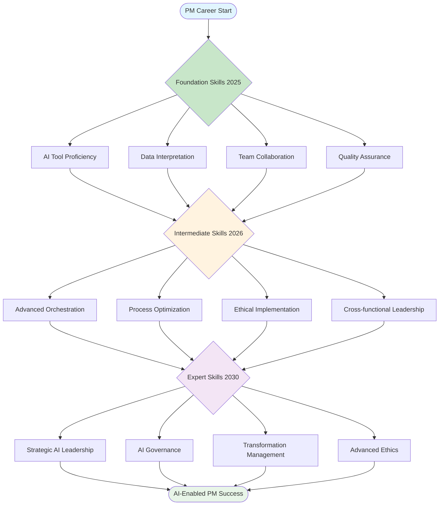

# Skill Matrix Visual Diagram

## PM Skills Evolution 2025-2030

```mermaid
graph TB
    subgraph "2025 Foundation"
        A1[AI Tool Proficiency]
        A2[Data Interpretation]
        A3[Team Collaboration]
        A4[Quality Assurance]
    end
    
    subgraph "2026 Intermediate"
        B1[Advanced Orchestration]
        B2[Process Optimization]
        B3[Ethical Implementation]
        B4[Cross-functional Leadership]
    end
    
    subgraph "2030 Expert"
        C1[Strategic AI Leadership]
        C2[AI Governance]
        C3[Transformation Management]
        C4[Advanced Ethics]
    end
    
    A1 --> B1
    A2 --> B2
    A3 --> B3
    A4 --> B4
    
    B1 --> C1
    B2 --> C2
    B3 --> C3
    B4 --> C4
    
    style A1 fill:#28a745,stroke:#fff,stroke-width:2px,color:#fff
    style A2 fill:#ffc107,stroke:#333,stroke-width:2px,color:#333
    style A3 fill:#dc3545,stroke:#fff,stroke-width:2px,color:#fff
    style A4 fill:#6f42c1,stroke:#fff,stroke-width:2px,color:#fff
    
    style B1 fill:#20c997,stroke:#fff,stroke-width:2px,color:#fff
    style B2 fill:#fd7e14,stroke:#fff,stroke-width:2px,color:#fff
    style B3 fill:#e83e8c,stroke:#fff,stroke-width:2px,color:#fff
    style B4 fill:#8e44ad,stroke:#fff,stroke-width:2px,color:#fff
    
    style C1 fill:#17a2b8,stroke:#fff,stroke-width:2px,color:#fff
    style C2 fill:#6c757d,stroke:#fff,stroke-width:2px,color:#fff
    style C3 fill:#343a40,stroke:#fff,stroke-width:2px,color:#fff
    style C4 fill:#495057,stroke:#fff,stroke-width:2px,color:#fff
```

## Capability Areas Matrix

```mermaid
quadrantChart
    title PM AI Skills Matrix 2025-2030
    x-axis "Technical Complexity" --> "Strategic Impact"
    y-axis "Individual Skills" --> "Leadership Skills"
    
    quadrant-1 "Strategic Leadership"
    quadrant-2 "Technical Expertise"
    quadrant-3 "Foundation Skills"
    quadrant-4 "Team Leadership"
    
    "Strategic AI Leadership": [0.9, 0.9]
    "AI Governance": [0.8, 0.8]
    "Transformation Management": [0.7, 0.9]
    "Advanced Ethics": [0.6, 0.8]
    "Advanced Orchestration": [0.7, 0.6]
    "Process Optimization": [0.6, 0.5]
    "Ethical Implementation": [0.5, 0.6]
    "Cross-functional Leadership": [0.4, 0.7]
    "AI Tool Proficiency": [0.3, 0.2]
    "Data Interpretation": [0.4, 0.3]
    "Team Collaboration": [0.2, 0.4]
    "Quality Assurance": [0.3, 0.3]
```

## Skill Development Roadmap

```mermaid
journey
    title PM AI Skills Development Journey
    section 2025 Foundation
      Learn AI Tools: 5: PM
      Master Prompting: 4: PM
      Data Interpretation: 4: PM
      Team Collaboration: 3: PM
      Quality Assurance: 3: PM
    section 2026 Intermediate
      Advanced Orchestration: 4: PM
      Process Optimization: 4: PM
      Ethical Implementation: 5: PM
      Cross-functional Leadership: 4: PM
    section 2030 Expert
      Strategic AI Leadership: 5: PM
      AI Governance: 5: PM
      Transformation Management: 5: PM
      Advanced Ethics: 5: PM
```

## Learning Path Visualization

```mermaid
flowchart TD
    Start([PM Career Start]) --> Foundation{Foundation Skills 2025}
    
    Foundation --> AI_Tools[AI Tool Proficiency]
    Foundation --> Data_Interp[Data Interpretation]
    Foundation --> Team_Collab[Team Collaboration]
    Foundation --> Quality[Quality Assurance]
    
    AI_Tools --> Intermediate{Intermediate Skills 2026}
    Data_Interp --> Intermediate
    Team_Collab --> Intermediate
    Quality --> Intermediate
    
    Intermediate --> Advanced_Orch[Advanced Orchestration]
    Intermediate --> Process_Opt[Process Optimization]
    Intermediate --> Ethical_Impl[Ethical Implementation]
    Intermediate --> Cross_Lead[Cross-functional Leadership]
    
    Advanced_Orch --> Expert{Expert Skills 2030}
    Process_Opt --> Expert
    Ethical_Impl --> Expert
    Cross_Lead --> Expert
    
    Expert --> Strategic_Lead[Strategic AI Leadership]
    Expert --> AI_Gov[AI Governance]
    Expert --> Transform[Transformation Management]
    Expert --> Advanced_Ethics[Advanced Ethics]
    
    Strategic_Lead --> Success([AI-Enabled PM Success])
    AI_Gov --> Success
    Transform --> Success
    Advanced_Ethics --> Success
    
    style Start fill:#e1f5fe
    style Foundation fill:#c8e6c9
    style Intermediate fill:#fff3e0
    style Expert fill:#f3e5f5
    style Success fill:#e8f5e8
```
